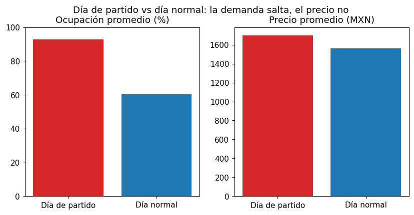
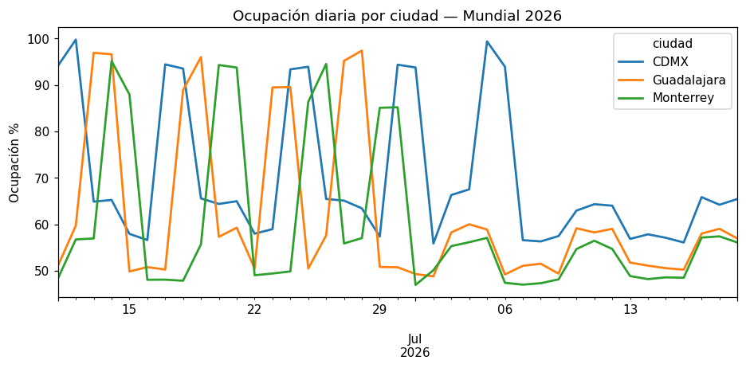

# ⚽ Demanda y Pricing Hotelero — Mundial 2026 / World Cup 2026 Hotel Demand

> **ES** — Proyecto **end-to-end de análisis de datos**: de una pregunta de negocio a una
> recomendación, usando **SQL**. Modela la demanda y los precios de hoteles en las sedes
> mexicanas del Mundial 2026 (CDMX, Guadalajara, Monterrey), encuentra dónde el precio no
> sigue a la demanda y cuantifica la oportunidad. Incluye dashboard interactivo.
>
> **EN** — An **end-to-end data analysis** project: from a business question to a
> recommendation, using **SQL**. Models hotel demand and pricing across Mexico's 2026
> World Cup host cities, finds where price lags demand, and quantifies the opportunity.
> Includes an interactive dashboard.

   

---

## 🇪🇸 Español

### La pregunta de negocio
Durante el Mundial la ocupación hotelera se dispara en las sedes. **¿Los hoteles están
cobrando lo que la demanda permite, o están dejando dinero sobre la mesa?**

### El enfoque (SQL de principio a fin)
1. **Datos** (`src/mundial_demanda/datos.py`): genera datos sintéticos deterministas de
   ocupación y precio por hotel y día, modelando picos de demanda en días de partido.
2. **Consultas** (`src/mundial_demanda/consultas.py`): preguntas de negocio en SQL —
   `JOIN` entre hoteles/ocupación, `LEFT JOIN` con partidos, `GROUP BY` y agregación.
3. **Análisis** (`src/mundial_demanda/analisis.py`): traduce los números en una
   **recomendación de pricing** cuantificada.

### El hallazgo
| | Ocupación | Precio |
|---|---|---|
| **Día de partido** | **92.9%** (+54% demanda) | +9% |
| Día normal | 60.3% | — |

La demanda casi llena los hoteles, pero el precio apenas se mueve.




### La recomendación
**Subir las tarifas de día de partido ~20%.** Sobre la demanda del Mundial en las sedes,
eso son **~$5.2 M MXN adicionales — sin agregar un solo cuarto.**

### Cómo correrlo
```bash
pip install -r requirements.txt
python scripts/construir_datos.py     # genera la base SQLite
python scripts/reporte.py             # imprime hallazgos + recomendación
streamlit run app/streamlit_app.py    # dashboard interactivo
```

### Estructura
```
proyecto-09-mundial-demanda/
├── src/mundial_demanda/   # datos (generación+SQLite), consultas (SQL), analisis (recomendación)
├── scripts/               # construir_datos.py, reporte.py
├── app/streamlit_app.py   # dashboard (mapa de calor, comparativas, tabla)
└── tests/                 # 5 pruebas: datos, consultas SQL y recomendación
```

---

## 🇬🇧 English

During the World Cup, hotel occupancy spikes in host cities — but is pricing keeping up?
This project generates deterministic synthetic occupancy/price data, answers business
questions in **SQL** (`JOIN`, `LEFT JOIN`, `GROUP BY`, aggregation), and turns the result
into a **quantified pricing recommendation**: on match days occupancy reaches **92.9%**
(+54% demand) while price rises only **+9%** → raising match-day rates ~20% means
**~$5.2M MXN extra**. Ships with a Streamlit/Plotly dashboard. Run `scripts/reporte.py`
for the analysis or `streamlit run app/streamlit_app.py` for the dashboard. 5 tests.
