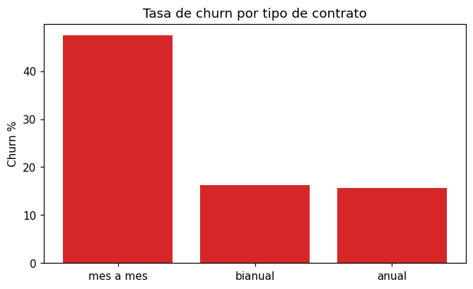
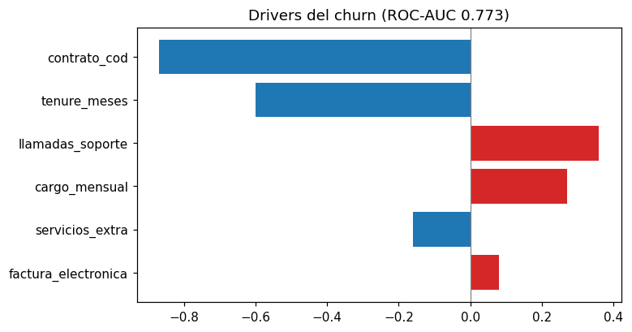

# 📉 Predicción de Churn de Clientes / Customer Churn Prediction

> **ES** — Proyecto **end-to-end**: de segmentos en **SQL** a un **modelo de machine
> learning** y una **recomendación de retención** con valor en pesos. Predice qué
> clientes van a abandonar y, sobre todo, qué hacer al respecto.
>
> **EN** — An **end-to-end** project: from **SQL** segments to a **machine learning**
> model and a **retention recommendation** with a peso value. Predicts which customers
> will churn and, above all, what to do about it.

   

---

## 🇪🇸 Español

### La pregunta de negocio
Retener un cliente es mucho más barato que conseguir uno nuevo. **¿Qué clientes están a
punto de irse y qué los empuja a hacerlo?**

### El enfoque (SQL → ML → negocio)
1. **Datos** (`src/churn/datos.py`): clientes sintéticos deterministas (tipo telco), con
   churn generado de una función logística sobre variables reales.
2. **Segmentos en SQL** (`src/churn/consultas.py`): tasa de abandono por contrato,
   antigüedad y llamadas a soporte (`GROUP BY`, `CASE WHEN`).
3. **Modelo** (`src/churn/modelo.py`): regresión logística — sus coeficientes se leen como
   los *drivers* del churn, no solo predicen.
4. **Recomendación** (`src/churn/analisis.py`): traduce el riesgo en una acción con valor.

### El hallazgo
| Segmento | Churn |
|---|---|
| Contrato **mes a mes** | **47.5%** |
| Contrato anual / bianual | ~16% |
| Antigüedad < 12 meses | 54.7% |

**ROC-AUC del modelo: 0.773.** Drivers principales: contrato mes a mes ↑, poca
antigüedad ↑, llamadas a soporte ↑.




### La recomendación
El segmento de mayor riesgo (**mes a mes con 3+ llamadas a soporte: 58% de churn**)
concentra el problema. Una campaña proactiva (oferta de contrato anual + atención
prioritaria) que retenga solo el 30% de los que se irían **rescata ~$33,000 MXN/mes**
de ingreso recurrente.

### Cómo correrlo
```bash
pip install -r requirements.txt
python scripts/construir_datos.py     # genera la base SQLite
python scripts/reporte.py             # segmentos SQL + modelo + recomendación
streamlit run app/streamlit_app.py    # dashboard interactivo
```

### Estructura
```
proyecto-10-churn-prediction/
├── src/churn/   # datos, consultas (SQL), modelo (scikit-learn), analisis, visual
├── scripts/     # construir_datos.py, reporte.py
├── app/streamlit_app.py
└── tests/       # 6 pruebas: datos, SQL, modelo (AUC), recomendación, figura
```

---

## 🇬🇧 English

Retention beats acquisition. This project builds deterministic telco-style customer data,
profiles churn by segment in **SQL** (`GROUP BY`, `CASE WHEN`), trains an interpretable
**logistic regression** (ROC-AUC **0.773**) whose coefficients reveal the churn drivers,
and turns it into a **quantified retention recommendation**: the highest-risk segment
(month-to-month customers with 3+ support calls, **58% churn**) is where to act — a
proactive campaign retaining just 30% of them rescues **~$33k MXN/month** in recurring
revenue. Run `scripts/reporte.py` for the analysis or `streamlit run app/streamlit_app.py`
for the dashboard. 6 tests.
