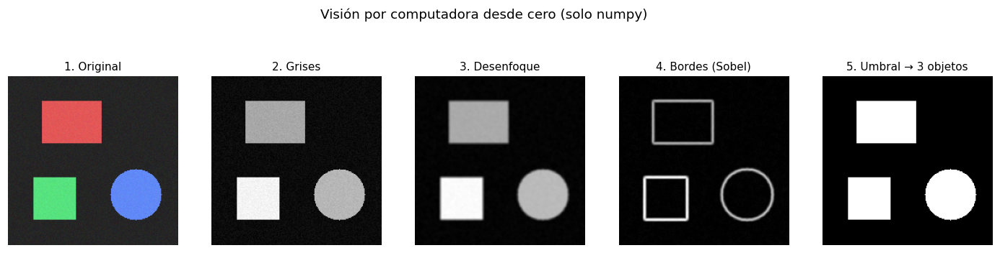
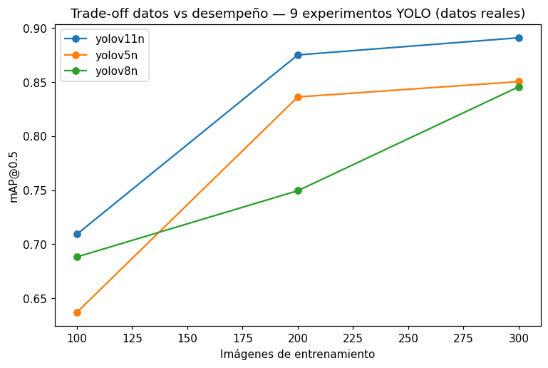

# 👁️ Visión por Computadora — Fundamentos desde Cero + Análisis de Experimentos

> **ES** — Proyecto de referencia en visión por computadora con dos partes: (1) las
> operaciones base de CV **implementadas desde cero en numpy** (entender qué hay debajo
> de OpenCV/YOLO) y (2) el **análisis comparativo de 9 experimentos YOLO reales**
> (arquitectura × cantidad de datos).
>
> **EN** — A computer-vision reference project in two parts: (1) the core CV operations
> **implemented from scratch in numpy** (understanding what's under OpenCV/YOLO) and
> (2) a **comparative analysis of 9 real YOLO experiments** (architecture × data size).

  

---

## 🇪🇸 Español

### Parte 1 — Visión desde cero (`src/vision/fundamentos.py`)
Una imagen es un arreglo de números, y casi todo en CV clásica es una **convolución**.
Implementado a mano, sin OpenCV ni torch:
- escala de grises (luminancia), **convolución 2D**, kernel y desenfoque gaussiano,
- detección de bordes **Sobel**, umbralizado binario,
- **conteo de objetos** por componentes conexas (flood-fill desde cero).

El pipeline completo sobre una imagen sintética (detecta **3 objetos**):



### Parte 2 — Análisis de 9 experimentos YOLO (`src/vision/experimentos.py`)
Análisis de **entrenamientos reales** (proyecto de LSM): 3 arquitecturas × 3 tamaños
de dataset. Lee el `results.csv` de cada run y compara el desempeño final.

| | 100 imgs | 200 imgs | 300 imgs |
|---|---|---|---|
| yolov5n | 0.637 | 0.836 | 0.851 |
| yolov8n | 0.688 | 0.750 | 0.846 |
| **yolov11n** | 0.709 | 0.875 | **0.891** |

*(mAP@0.5). Mejor: **yolov11n con 300 imágenes (0.891)**.*



**Hallazgo:** más datos siempre ayudan, pero con **rendimientos decrecientes** (el
salto grande es de 100→200 imágenes); yolov11n domina en todos los tamaños.

### Cómo correrlo
```bash
pip install -r requirements.txt
python scripts/demo_fundamentos.py        # pipeline desde cero + figura
python scripts/analisis_experimentos.py   # tabla + gráfica del trade-off
```

### Estructura
```
proyecto-11-vision-fundamentos/
├── src/vision/   # fundamentos (CV desde cero) + experimentos (análisis de runs)
├── scripts/      # demo_fundamentos.py, analisis_experimentos.py
├── data/runs/    # results.csv reales de los 9 entrenamientos
└── tests/        # 7 pruebas: convolución, Sobel, conteo, carga de experimentos
```

---

## 🇬🇧 English

Two parts: **(1) CV from scratch** — grayscale, 2D convolution, Gaussian blur, Sobel
edges, thresholding and connected-components object counting, all hand-written in numpy
(no OpenCV/torch); and **(2) analysis of 9 real YOLO experiments** (3 architectures × 3
dataset sizes) reading each run's `results.csv`. Best model: **yolov11n with 300 images
(mAP@0.5 0.891)**; more data helps with diminishing returns. Run `demo_fundamentos.py`
for the from-scratch pipeline or `analisis_experimentos.py` for the trade-off analysis.
7 tests, all light-dependency (numpy/pandas/matplotlib).
